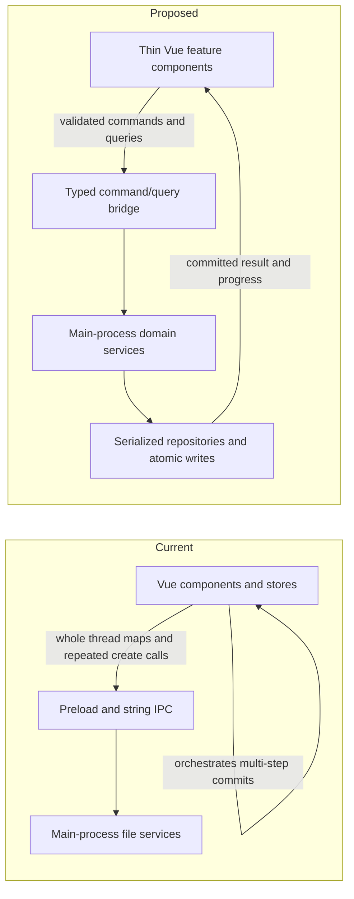

# Release Architecture, Stability, and Security Review

**Date:** 2026-07-27

**Reviewed version:** `1.3.2`, branch `vlads-dev`, commit `e3421bc`

**Decision:** **Do not cut the release yet.** The feature direction is sound, but the privileged-window navigation/IPC boundary, the end-of-support Electron runtime, and fix-available vulnerable parsing dependencies on attacker-controlled content paths are release blockers.

## Executive takeaways

The release adds useful capabilities without collapsing everything into one file. Bulk import has a good parser/transport/orchestration split, the secrets resolver has explicit precedence and testable backends, the provider registry gives AI settings a reasonable extension point, and the settings redesign improves operator usability.

The main architectural weakness is that the Electron main process is not yet the authoritative application/domain boundary. It is partly a persistence service, while the renderer still owns multi-step archive mutations and can send whole, unvalidated state snapshots. That creates three related risks:

1. A renderer compromise has a large write surface.
2. Multi-file operations can leave the archive partially committed.
3. Every feature implements its own mutation, retry, validation, and recovery behavior.

The release should be stabilized by making the main process the sole owner of validated archive commands and atomic persistence, not by patching each UI flow independently.

## Review method and validation snapshot

Reviewed:

- Electron startup, window configuration, preload bridge, and all IPC handlers.
- Settings UI, provider/model catalog, Anthropic/OpenAI implementations, and AI capability use.
- Secrets resolution, `safeStorage` persistence, environment overrides, and legacy cleanup.
- Shared-link import, Gemini hidden-window extraction, bulk import, archive readers, format registry, deduplication, and commit behavior.
- QA/thread/tag/embedding persistence and data-directory switching.
- Renderer stores, command routing, major components, tests, packaging, and documentation.

Validation performed:

- `npm run build`: **passed** (`vue-tsc --noEmit` plus all Vite builds).
- `npm test`, after the concurrent ChatGPT fixture work completed: **195 passed, 1 platform-dependent test skipped**. Two passing bulk-import cases still emit a non-fatal tag-dictionary `TypeError`; see TEST-01.
- `npx eslint .`: **0 errors, 23 warnings**. Most are type/cleanup debt; one is the expected `v-html` security warning on `MarkdownRenderer.vue`.
- `npm audit --omit=dev`: **4 vulnerable package entries (3 high, 1 moderate)**. The runtime-reachable findings are detailed under DEP-01; the PostCSS entry is currently a build-time toolchain exposure.
- Persistent Playwright/visual suites were not run, per repository instructions.

The working tree changed externally during the review. ChatGPT sharded-export support, fixtures, tests, and documentation were completed after the initial baseline and committed as `49c42a7`. A final narrow UI fix in `e3421bc` now catches rejected file-import IPC calls and reports them to the user. This document reviews the resulting `e3421bc` filesystem state but does not modify those implementation files. Each concurrent pass was handled by re-reading only the changed files, their immediate contracts, and their focused tests; unrelated areas were not rescanned.

## Architecture assessment

### What is working well

- **Import layering is directionally correct.** `formatRegistry.ts`, pure provider parsers, `archiveReader.ts`, `buildResult.ts`, and `bulkImportService.ts` separate recognition, parsing, normalization, and commit responsibilities. This is the best-modularized feature family in the repository. The latest ChatGPT pass also correctly reconstructs the selected `current_node` branch and covers sharded ZIP, extracted-folder, and bare-shard entry points.
- **File-import rejection is now visible.** Commit `e3421bc` catches rejected import IPC calls at the UI coordinator and presents the error instead of leaving an unhandled promise rejection.
- **Bulk preview keeps bodies out of the renderer.** The main process retains full content and exposes only summaries through a preview token.
- **The Gemini Takeout implementation handles difficult real-world details.** It structurally distinguishes Gemini from other Takeout products, supports HTML and JSON, reports lossy cases, and avoids pretending the activity log contains real conversation grouping.
- **Secret values are write-only from the renderer's perspective.** Status projections expose presence, provenance, and masked previews rather than raw stored values.
- **Secret precedence is explicit and testable.** The environment overlay does not accidentally become persisted when another key is saved.
- **Security basics exist.** The primary renderer has a restrictive CSP, context isolation is enabled, and Node integration is disabled. Markdown rendering disables embedded HTML.
- **Central accelerator metadata reduces drift.** Native menu hints and renderer shortcuts use `shared/accelerators.ts`.
- **Destructive reset is recoverable.** Archive reset moves data to a backup rather than deleting it outright.
- **E2E data isolation is carefully designed.** The Electron fixture pins both the archive directory and Electron `userData`.

These seams should be preserved. The proposed changes below strengthen boundaries around them rather than replacing them wholesale.

### Current and proposed responsibility boundary

## Prioritized findings

| ID | Priority | Finding | Release impact |
|---|---|---|---|
| SEC-01 | P0 | The privileged main window can navigate to external content, while preload exposes mutating APIs and IPC handlers do not validate senders. | Remote content can reach archive/settings operations after a user follows an imported link. |
| SEC-02 | P0 | Electron `33.4.11` is end-of-support. | The shipped Chromium/Node/Electron security base no longer receives supported fixes. |
| DEP-01 | P0 | Runtime parsers used on imported content have fix-available algorithmic-complexity advisories. | A crafted imported answer or QA frontmatter can freeze the renderer or main process. |
| TEST-01 | P1 | Unit tests are green, but the required build command and packaging scripts do not run them. | A later release build can succeed while tests fail. |
| SET-01 | P1 | Settings save and connection testing use inconsistent draft/persisted state. | Partial saves, wrong-provider connection tests, and invalid provider/model pairs are possible. |
| DATA-01 | P1 | Persistence is direct, non-atomic, and split between renderer and main. | Crashes or write failures can truncate files or leave pairs/threads inconsistent. |
| IMP-01 | P1 | Bulk commit is not transactional or cancellable and has avoidable quadratic filesystem work. | Large real exports can block the main process and fail after partial writes. |
| IMP-02 | P1 | Import resource limits, preview ownership/lifetime, and selection identity are incomplete. | Large/malicious archives can exhaust memory; previews can leak; idless/duplicate source IDs cannot be selected correctly. |
| SEC-03 | P1 | Shared-link transport lacks a common redirect/timeout/size policy; the Gemini remote-render window also uses the default session without permission/window containment. | Remote imports can consume unbounded resources, and the browser-backed surface is broader than required. |
| SEC-04 | P1 | `safeStorage` availability is treated as equivalent to secure OS storage. Writes are non-atomic and legacy plaintext remains. | Linux `basic_text` can be mislabeled secure; a failed write can lose keys; plaintext backup risk persists. |
| DATA-02 | P1 | Archive-scoped data is stored in inconsistent namespaces and the embedding schema lacks model/archive identity. | Switching data directories can mix indexes; model changes can reuse incompatible vectors. |
| LLM-01 | P1 | Provider capabilities are represented as runtime exceptions and UI notes rather than enforceable contracts. | Anthropic can be selected for OpenAI-only paths; several reliability/accounting defects remain. |
| IPC-01 | P1 | Privileged IPC arguments are TypeScript-cast, not runtime-validated. | A compromised or buggy renderer can send malformed state and unsafe filenames/paths. |
| ARCH-01 | P2 | Contracts are duplicated across service, preload, global declarations, and renderer types. | Drift is already present and will increase with every provider/import option. |
| ARCH-02 | P2 | Several UI components are feature coordinators rather than components. | Changes are hard to isolate and regression-test; global custom events create hidden coupling. |
| DOC-01 | P2 | User guidance and build notes disagree with the current menu and feature behavior. | Operators are sent to nonexistent locations and maintainers get contradictory intent. |
| REL-01 | P2 | Windows artifacts are unsigned and there is no checked-in release workflow for checksums/provenance. | Wider distribution will trigger publisher warnings and gives recipients no repository-defined artifact verification path. |

## Detailed findings and proposals

### SEC-01 — privileged navigation plus unguarded IPC is a concrete attack chain

Evidence:

- `MarkdownRenderer.vue` renders Markdown links with `v-html`. Embedded HTML is disabled, which is good, but normal Markdown links remain active.
- `electron/main.ts` does not install `will-navigate`, `will-frame-navigate`, or `setWindowOpenHandler` policies on the primary window.
- The window's preload remains configured for navigations and exposes the full `window.api` object.
- `electron/ipc/handlers.ts` accepts calls without checking `event.senderFrame` or the expected application `webContents`.

Attack path:

1. Imported content contains a plausible Markdown link.
2. The user follows it and the application window navigates to a remote page.
3. The preload bridge is exposed to that page.
4. Remote JavaScript can invoke mutating channels such as settings/thread/QA writes, duplicate deletion, or archive reset.

This remains dangerous with `contextIsolation: true`; isolation does not make APIs deliberately exposed through `contextBridge` safe for an untrusted origin.

Required fix:

- Deny navigation away from the packaged application origin/file in the primary `BrowserWindow`.
- Deny all renderer-created windows by default.
- Intercept rendered links and open only parsed `https:` URLs in the system browser.
- Wrap every privileged IPC handler in one sender validator. Accept only the expected main application frame.
- Add an automated test that attempts same-window navigation and invokes a privileged channel from an unexpected frame.
- Explicitly set or globally enforce renderer sandboxing so the intended policy is visible in code.

Electron's own security checklist specifically calls for limiting navigation/windows, validating every IPC sender, and not exposing Electron APIs to untrusted web content: [Electron Security](https://www.electronjs.org/docs/latest/tutorial/security).

### SEC-02 — unsupported Electron runtime

`package-lock.json` and the installed package resolve Electron to `33.4.11`. Electron 33 reached end of life on 2025-04-29. As of this review, Electron officially supports only the latest three stable major versions: 41, 42, and 43.

Required fix:

- Review breaking changes one major at a time, then land on a currently supported line and its latest patch/minor. On the review date, the newest stable patches are 41.10.3, 42.7.1, and 43.2.0; prefer the newest line compatible with the product's OS support policy.
- Run build, unit, Electron E2E smoke, shared-link import, and Windows packaging checks after each major.
- Add a scheduled dependency/Electron currency check to the release process.

Sources: [Electron release/EOL schedule](https://releases.electronjs.org/schedule), [Electron support policy](https://www.electronjs.org/docs/latest/tutorial/electron-timelines), [current stable releases](https://releases.electronjs.org/?channel=stable).

### DEP-01 — vulnerable parsers are reachable through imported content

The dependency audit is not just generic lockfile noise:

- `MarkdownRenderer.vue` instantiates `markdown-it@14.1.0` with both `typographer: true` and `linkify: true`.
- Those exact paths reach the current quadratic-CPU advisories in `markdown-it` and its `linkify-it@5.0.0` dependency. A few hundred kilobytes of crafted quotes or repeated `mailto:` text can block the renderer event loop.
- `qaPairService.ts` parses QA frontmatter with `gray-matter@4.0.3`, which resolves its own `js-yaml@3.14.2`. The affected merge-key path can consume quadratic CPU in the main process while loading a crafted archive file.
- `postcss@8.5.6` also has high advisories. In this repository it is reached through Vite/Vue compilation, not application parsing at runtime; it still needs a toolchain update, but it is not equivalent to the two imported-content paths above.

Required fix:

- Regenerate the lockfile with patched versions: `markdown-it >= 14.2.0`, `linkify-it >= 5.0.2`, `js-yaml >= 3.15.0` for the gray-matter branch, and `postcss >= 8.5.18`.
- Confirm the packaged bundle actually contains the patched parser versions, not only patched top-level declarations.
- Add `npm audit --omit=dev` to the release gate with an explicit, reviewed exception mechanism for demonstrably build-only advisories.
- Keep bounded input sizes even after upgrading; dependency fixes do not replace application-level import/render budgets.
- Add small regression fixtures for the pathological quote, `mailto:`, and YAML merge-chain shapes with a conservative execution-time ceiling.

Sources: [markdown-it smartquotes advisory](https://github.com/advisories/GHSA-6v5v-wf23-fmfq), [linkify-it `mailto:` advisory](https://github.com/advisories/GHSA-v245-v573-v5vm), [js-yaml merge-chain advisory](https://github.com/advisories/GHSA-52cp-r559-cp3m), [PostCSS source-map advisory](https://github.com/advisories/GHSA-r28c-9q8g-f849).

### TEST-01 — the tests improved, but the release gate does not enforce them

The concurrent ChatGPT work added deterministic fixtures and updated tracked assertions; the current tracked unit suite is green. However, `npm run build` and the packaging scripts still do not require unit tests, so a future code/test mismatch would not block a canonical release build. There is also no checked-in CI workflow to enforce an equivalent gate outside a developer workstation.

The green count also overstates one integration seam: two `commitArchiveImport` tests emit `tag dictionary update failed TypeError` because the Electron `app` dependency is not available in that test path. `registerImportTags()` catches the failure, so the tests pass without demonstrating that imported tags were registered. Expected negative-path logging in other tests is legitimate; this one is an unverified side effect.

Proposal:

- Preserve the new sanitized ChatGPT fixtures as the regression source of truth.
- Preserve the new ZIP, extracted-folder, and bare-sibling sharded cases. Add assertions for deterministic numeric shard ordering, mixed matching/non-matching entries, aggregate limits, duplicate conversations across shards, and one unreadable or structurally corrupt shard.
- Supply a complete Electron/settings test seam for bulk commit and assert tag-dictionary effects. Treat unexpected error logs as test failures unless the test explicitly expects them.
- Add a non-mutating `npm run check` that runs typecheck, `eslint .`, unit tests, and build. Keep the existing expensive UI suites separate.
- Make release packaging depend on `check`, not only `build`.

### SET-01 — settings do not commit as one coherent draft

Three bugs share the same root:

- `SettingsDialog.save()` persists settings first, emits the Lens change, then saves keys. If secure storage fails, the dialog stays open but settings are already active; pressing Cancel cannot undo them.
- `testConnection()` saves a typed key, then calls `ai:testConnection` with no draft provider/model. The main process tests the previously persisted provider/model, not necessarily the provider currently selected in the dialog.
- Provider changes load models asynchronously. Save is not gated by that load, so a provider can be persisted with a model from another provider. `loadModelCatalog()` also reads `llmProvider.value` again after its `await`; a slower response for the previous provider can therefore be stored under the newly selected provider and replace the current model.

Changing `dataDirectory` has the same partial-application problem: it becomes the active setting before the target is validated and loaded successfully.

Proposal:

- Introduce a `SettingsDraft` command with main-side validation.
- Make connection testing explicit: `{ providerId, modelId, apiKeyOverride }`.
- Validate that the provider is enabled and the model belongs to it at both save time and provider construction time.
- Validate a new data directory by probing read/write access and returning an archive summary before activation.
- Apply settings and secret changes as one operation with a structured per-field result, or clearly separate “Apply archive location” from “Save AI credentials” so Cancel semantics are honest.

### DATA-01 — persistence and mutation ownership need a repository boundary

`settings.json`, `threads.json`, the tag dictionary, embeddings, model cache, secrets envelope, and QA Markdown updates are written directly with `writeFileSync`. A crash or full disk can truncate the only copy. There is no serialized mutation queue or recovery from a last-known-good file.

The renderer can also replace the entire thread map through `threads:save`. Shared-link and Markdown imports create pairs and then construct threads through many independent IPC calls. Bulk import does the same work in main through a separate path.

Read-side failure semantics compound the risk:

- Corrupt settings fall back to defaults; corrupt tags and embeddings fall back to empty stores. A later ordinary save can overwrite the recoverable corrupt file with that default/empty projection.
- A malformed QA Markdown file is logged and omitted from `listAllPairs()`, while duplicate IDs silently replace one another in the returned object.
- The control files and frontmatter are cast to TypeScript interfaces without schema/version validation, so structurally invalid but parseable data can travel farther before failing.

Proposal:

- Add main-owned `ArchiveRepository`, `SettingsRepository`, and `SecretRepository`.
- Use validated commands (`CreateThread`, `AddPairsToThread`, `MovePair`, `CommitImport`) instead of whole-state replacement.
- Serialize mutations per archive.
- Write to a sibling temporary file, flush when warranted, then atomically replace; retain/recover a last-known-good copy for small JSON control files.
- Quarantine parse failures instead of converting them into writable empty/default state. Report skipped QA paths and duplicate IDs as archive-health errors, and require an explicit repair decision before overwrite.
- Version and runtime-validate every persisted control-file schema; perform migrations against a backup.
- Return a commit ID/result only after every required control-file write succeeds.
- Keep renderer stores as projections of committed state, not writable sources of truth.

### IMP-01 — bulk commit can be slow and partially durable

`commitArchiveImport()` writes pairs one at a time and saves `threads.json` only after the batch. If the process exits or `saveThreads()` fails, created Markdown files remain unthreaded while the IPC call reports failure and the preview is released.

Performance degrades with archive size:

- `createPair()` calls `generateUniqueId()`.
- `generateUniqueId()` enumerates the whole archive directory for each pair.
- A multi-thousand-pair import therefore repeatedly scans a growing directory.
- The sharded ZIP path calls `fetchZipEntry()` once per shard; each call reopens and walks the ZIP, making discovery effectively proportional to shard count times archive-entry count.
- Parsing and synchronous file writes occur on the main process, with no cancellation/checkpoint contract.

Proposal:

- Precompute existing IDs/filenames once and allocate IDs from an in-memory set.
- Build an import manifest with pair temp files and the final thread-map update.
- Commit through a staging directory/journal, then promote files and control state.
- On startup, detect and offer to resume/roll back an incomplete import.
- Make the commit async and cancellable between bounded chunks; move CPU-heavy parsing/indexing to a worker or utility process if profiling confirms main-process stalls.
- Include import batch identity in metadata so a completed batch can be audited or rolled back.

### IMP-02 — limits, previews, and selection need stronger contracts

Positive: a single zip entry is capped and full bodies stay in main.

Gaps:

- The per-entry ceiling is 512 MiB, but there is no aggregate decompressed-byte, shard-count, conversation-count, pair-count, or total-text limit.
- Matching ChatGPT shards are not structurally revalidated as a set, are not explicitly sorted by numeric shard index, and folder read errors are logged and omitted. A damaged export can therefore become a successful-looking partial import with container-dependent ordering.
- Sharded imports retain all normalized bodies in `pendingPreviews`.
- Preview entries have no TTL, owner `webContents`, or cleanup on window destruction.
- Preview IDs use time plus `Math.random`, not a cryptographic opaque token.
- Conversation selection uses provider `sourceId`. Empty IDs are disabled, and duplicate IDs map several visible rows to the same selection value.

Proposal:

- Add conservative aggregate budgets and fail with a structured “export too large” result.
- Build and validate a shard manifest before parsing: sort numerically, reject duplicate indices, report gaps when they matter, and fail or return an explicit partial-import warning naming every unreadable or invalid shard.
- Use `crypto.randomUUID()` and bind each preview to its requesting `webContents`.
- Add expiry and cleanup on sender/window destruction.
- Assign an internal unique `previewThreadId` to every row; keep `sourceId` only for dedup/provenance.
- Stream or spill large preview bodies to a private temporary directory instead of retaining the complete object graph indefinitely.

### SEC-03 — shared-link transport and Gemini rendering need containment

The supported direct Gemini hosts are more accurate than before, but the documented `g.co/gemini/share/...` short-link form is still not resolved. `renderGemini()` loads a user-supplied URL in a hidden `BrowserWindow` with:

- `http:` accepted as well as `https:`;
- automatic navigation/redirect behavior;
- no `setWindowOpenHandler`;
- no permission request handler;
- the default persistent session/cookies;
- no approved redirect chain or final-origin check.

Both the main and renderer debug traces also log raw share URLs/IDs.

The JSON transport has related resource-policy gaps: `fetchJson()` follows redirects automatically, has no request timeout, and buffers the complete response before parsing without a byte ceiling. Its current callers construct fixed provider API origins, which limits SSRF exposure, but the absence of one shared transport policy is fragile as more providers and aliases are added.

Proposal:

- Require HTTPS, no credentials, no non-default port, and an exact registered host/path.
- Resolve documented short links through a bounded redirect resolver; validate every hop and the final canonical provider URL.
- Use a unique non-persistent session partition, deny permissions, deny popups, and block off-policy main-frame navigation/redirects.
- Redact share tokens from logs.
- Apply redirect-hop, final-origin, response-size, and timeout limits to both JSON and browser-backed transports.
- Return structured errors (`invalid-url`, `redirect-disallowed`, `private-or-expired`, `format-changed`).

### SEC-04 — safe storage is a good base, not a complete guarantee

The resolver and write-only renderer design are strong. Remaining issues:

- On Linux, Electron can report the `basic_text` backend, which uses a hardcoded plaintext password. The current implementation checks only `isEncryptionAvailable()` and labels the backend “encrypted local storage.”
- The synchronous API can block for Keychain/keyring interaction; current Electron documentation recommends the asynchronous API for new work.
- `secrets.enc.json` is overwritten directly, so an interrupted write can destroy the previous valid ciphertext.
- `secrets.json.orphaned.bak` remains plaintext until manually deleted. Application Status reports it, but there is no in-app purge/migrate action.

Proposal:

- On Linux, inspect `safeStorage.getSelectedStorageBackend()` and treat `basic_text` as insecure/unavailable unless the user explicitly accepts the risk.
- Plan migration to the asynchronous safe-storage API during the Electron upgrade.
- Make encrypted-envelope writes atomic and preserve the last valid envelope.
- Add “migrate/purge legacy plaintext” with explicit confirmation and post-action verification.
- Document the Windows same-user boundary and Linux backend in Application Status.

Source: [Electron `safeStorage` platform semantics](https://www.electronjs.org/docs/latest/api/safe-storage).

### DATA-02 — archive identity and derived indexes are not aligned

Examples:

- `pathResolver.getDataDir()` treats a selected `archive` folder as its parent, but `tagDictionaryService` calls raw `getDataDirectory()`. The same setting can therefore place QAs/threads and tags in different roots.
- `embeddings.json` lives globally under Electron `userData`, not under or namespaced by the selected archive.
- Embedding entries contain only content hash and vector. They do not record archive ID, provider, embedding model, dimensions, or schema version.
- Changing archives or embedding models can reuse stale/incompatible entries because content hash alone is considered current.
- Deleted QA embeddings are not removed.

Proposal:

- Resolve every archive-owned path through one `ArchivePaths` value object.
- Give each archive a stable ID and namespace derived indexes by it, either under the archive or under `userData/indexes/<archiveId>`.
- Version embedding records with provider/model/dimension; rebuild when any identity field changes.
- Validate vector dimensions before cosine similarity.
- Garbage-collect IDs absent from the current archive and perform this check on data-directory activation.

### LLM-01 — make capabilities first-class

`LLMProvider` requires both `complete()` and `embed()`, so Anthropic implements `embed()` by throwing. Provider descriptors advertise model discovery, but not completion/embedding capabilities. The “Generate All Embeddings” command remains available regardless of selected provider, despite notes saying it is disabled for Anthropic.

Unresolved reliability issues also remain in the Anthropic path:

- hand-written `fetch` calls have no explicit timeout/cancellation/retry policy;
- `max_tokens: 2000` and no `stop_reason`/refusal handling can yield empty or truncated output;
- Anthropic usage is not added to the token tracker;
- full third-party error bodies can reach logs/UI;
- `modelCatalogService.ts` combines cache persistence, provider dispatch, network clients, hints, and fallback policy.

Proposal:

- Separate `CompletionProvider` and `EmbeddingProvider`, or declare explicit capabilities and request a capability from the factory.
- Allow independent completion and embedding provider settings if mixed use is intended.
- Hide/disable actions from capabilities, not provider-name string checks.
- Move each provider's completion and catalog clients into one adapter and use a shared timeout/retry/error-redaction policy.
- Store capability and model ownership in the registry; validate them at runtime.
- Add usage and stop-reason handling before calling Anthropic support stable.

### IPC-01 and ARCH-01 — one shared contract, with runtime validation

The same API shapes are re-declared in:

- Electron services;
- `electron/preload.ts`;
- `src/global.d.ts`;
- `src/types/*`;
- some component-local interfaces.

Drift is already visible: `BulkImportSelection.includeDateInThreadNames` exists in the domain/renderer declaration but is missing from preload's declaration; `originId` is not consistently projected in QA types.

TypeScript does not validate IPC payloads at runtime. `settings:save`, `threads:save`, QA create/update, tag dictionary save, deletion ID lists, semantic `topK`, and import selections trust the renderer's shape. `createPair()` also embeds the unvalidated `source` string in a filename.

Proposal:

- Create `shared/contracts/` for canonical serializable types and channel names.
- Add runtime parsers at the main-process boundary. Reject unknown fields where they affect files, secrets, or destructive actions.
- Sanitize filename components independently of UI/source validation.
- Generate or wrap preload methods from the channel contract so handler/preload/global declarations cannot drift.
- Return typed error codes rather than leaking arbitrary exception strings to the renderer.

### ARCH-02 — reduce feature-coordinator components

Current sizes are symptoms, not findings by themselves:

- `App.vue`: about 1,300 lines.
- `SettingsDialog.vue`: about 880 lines.
- `InsightsPanel.vue`: about 870 lines.
- `ThreadsPanel.vue` and `QAListPanel.vue`: about 800 lines each.

`App.vue` owns command registration, keyboard dispatch, every modal, both import orchestrators, reset/reload behavior, and layout. Child actions are also triggered through global `window` events such as `llm:save-current-edit` and `llm:rename-selected-thread`.

Proposal:

- Extract `useCommandRegistry`, `useImportCoordinator`, and `useArchiveReload`.
- Split Settings into tab components backed by one draft composable.
- Replace global custom DOM events with explicit store actions or typed component APIs.
- Keep `App.vue` as composition/layout plus top-level error boundary.
- Do this incrementally after the main-process command boundary lands; otherwise UI refactoring will only redistribute the same orchestration.

### DOC-01 — documentation no longer matches the code

Examples:

- Runtime menu places archive maintenance under **Tools**, while README/build notes and `insightsService.noEmbeddingsMessage()` still point to **View** or **Settings → AI**.
- Build notes claim the embeddings action is disabled for Anthropic; the command/menu remains available.
- The import technical findings still say ChatGPT account export is unverified, while commit `49c42a7` marks it validated.
- Older design notes describe desired behavior as if it were implemented.

Proposal:

- Correct user-facing locations and capability statements in the same stabilization change.
- Add a short status banner to superseded review/design documents rather than rewriting historical analysis.
- Keep `build-notes.md` behavioral and concise; keep dated architectural reviews immutable.

### REL-01 — distribution integrity is deferred

`electron-builder.yml` defines Windows installers, including MSI, but no signing configuration. README correctly states that the MSI is unsigned. The repository also has no checked-in release workflow that binds a commit to tested artifacts, hashes, or provenance.

This is acceptable for a private local build when the operator understands the warning. It is not a good long-term distribution boundary for broader use.

Proposal:

- Define the intended release audience explicitly. Keep unsigned artifacts clearly labeled as development/private builds.
- Before broader distribution, sign Windows installers and executables, notarize/sign macOS artifacts, and publish SHA-256 hashes plus the source commit and build environment.
- Build release artifacts only after the non-mutating check gate passes; retain a release manifest covering version, commit, dependency lock hash, targets, and signatures.

## Recommended delivery sequence

### Phase 0 — release blockers

1. Lock primary-window navigation/new-window behavior and validate every IPC sender.
2. Upgrade Electron to a supported line.
3. Upgrade the vulnerable Markdown/linkification/YAML dependencies and clear or explicitly triage the dependency audit.
4. Add `npm run check` and make packaging depend on it.
5. Run a focused Electron security smoke test and Windows package launch test.

### Phase 1 — release stabilization

1. Fix settings draft/test/apply semantics and provider/model validation.
2. Add atomic writes for secrets, settings, threads, tag dictionary, and QA updates.
3. Add import aggregate limits, cryptographic preview IDs, ownership, TTL, and unique row IDs.
4. Remove the per-pair archive directory scan and add a journaled bulk-import commit.
5. Contain the Gemini remote session and redact share tokens.
6. Namespace/version embeddings and resolve all paths through one archive-path service.

### Phase 2 — maintainability

1. Move to shared IPC/domain contracts with runtime schemas.
2. Split completion and embedding capabilities.
3. Decompose `App.vue` and Settings orchestration into feature composables/components.
4. Add repository failure-injection tests, Settings state-machine tests, provider adapter tests, and navigation/IPC security tests.

## Release acceptance gates

- [ ] Main window cannot navigate to remote content or create renderer windows.
- [ ] All privileged IPC handlers reject an unexpected sender/frame and malformed payload.
- [ ] Electron is on a supported major and current patch/minor.
- [ ] Imported-content parser dependencies are on patched versions; the production audit has no untriaged high/critical result.
- [ ] `npm run check` is green; no probe-only or failing tracked tests.
- [ ] Settings connection test uses the visible draft provider/model/key.
- [ ] Settings failure does not silently leave a partially applied state.
- [ ] Bulk import survives injected pair/thread/tag write failures with a recoverable manifest.
- [ ] Bulk import enforces aggregate byte/item limits and releases previews on cancel, expiry, and window destruction.
- [ ] Gemini rendering uses HTTPS, a non-persistent session, allowlisted redirects, denied permissions/popups, and redacted logs.
- [ ] Linux `basic_text` is not reported as secure storage.
- [ ] Switching data directories cannot reuse another archive's tag path or embedding index.
- [ ] README, in-app guidance, menus, and build notes agree.
- [ ] Any externally distributed artifact has a commit-linked manifest and appropriate platform signing, or is explicitly labeled a private unsigned build.

## Overall judgment

The code is not a failed design; it is a promising feature set sitting on a persistence and privilege boundary that has not caught up with its scope. The pure import layers, secret resolver, UI improvements, and test seams are good foundations. The safest route is to finish the boundary work now—before more providers, export targets, or agent-like features multiply the number of privileged commands and partial-write paths.

Once SEC-01, SEC-02, and DEP-01 are closed and the green test suite is enforced by the release gate, the release can be reconsidered. The Phase 1 items should be treated as the stability budget for broad use, with atomic persistence and settings correctness ahead of further feature additions.
