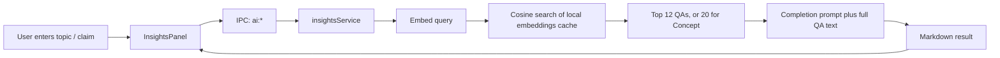

# LLM Lens Design, Usage, and Improvement Review

**Review date:** 2026-07-25

## What Lens Is For

LLM Lens is a retrieval-and-synthesis tool over the local Q&A archive. It is not a persistent chatbot, an agent that can act on files, or a web-connected researcher.

For each request, it:

1. Embeds the entered topic or claim.
2. Semantically retrieves the most relevant archive entries across the **whole archive**.
3. Sends the selected entries' full questions and answers to an LLM with a mode-specific instruction.
4. Renders the resulting Markdown analysis, which can be copied or saved as a new Q&A with source `lens`.

Its practical purpose is to help someone resume a research thread, avoid repeating prior work, test a belief against prior notes, identify unanswered questions, or summarize their current position on a concept.

## The Five Modes

- **Brief**: Separates relevant notes into established conclusions, unresolved items, and contradictions.
- **Prior Art**: Shows what the archive already covers and what remains open.
- **Steelman**: Looks for archive evidence supporting and challenging a stated hypothesis.
- **Gaps**: Generates 5-8 research questions grounded in gaps or tensions in retrieved notes.
- **Concept**: Synthesizes a concept into a working model, limitations, open questions, and abandoned directions.

These prompts are defined in `electron/services/insightsService.ts`. The feature UI is `src/components/InsightsPanel.vue`, mounted globally at the bottom of `src/App.vue`.

## How It Actually Works

The retrieval cache is `electron/services/embeddingService.ts`, persisted as `embeddings.json` in Electron user data. The code hashes each QA's question and answer, so a manual **Generate all embeddings** run only recomputes changed entries.

Lens does not use the selected Q&A, selected thread, tags, or current search scope as a filter. It always retrieves globally. It does not retain prior answers as chat context; only the last 20 prompts per mode are kept in browser `localStorage`.

## Real Usage Requirements

1. In **Settings -> AI**, select **OpenAI**, configure and test an OpenAI API key.
2. Click **Generate all embeddings**.
3. Open Lens from the sparkles toolbar button, the **View -> Toggle LLM Lens** menu item, or the command palette.
4. Select a mode, enter a topic or claim, and click **Run**. `Ctrl/Cmd+Enter` runs the focused Lens prompt.
5. Copy the answer or save it as a QA entry.

Despite generic wording elsewhere, Lens currently requires **OpenAI as the active provider**. Query retrieval calls `provider.embed()` every time, and `electron/services/llm/anthropicProvider.ts` deliberately throws for embeddings. Anthropic can run text completions elsewhere in the app, but cannot currently operate Lens end-to-end.

Also, Lens sends the retrieved QA text to the configured external provider. The archive is local-first at rest, but Lens analysis is not local-only processing.

## Documentation Status

The README already has a setup-only section, while `USAGE.md` contains the fuller mode-by-mode guide. That means the requested usage information is partially present, but it is split across documents and has inaccuracies:

- Both documents say `Ctrl/Cmd+L` opens Lens, but `src/App.vue` has no such shortcut handler.
- `USAGE.md` implies either OpenAI or Anthropic can support analysis, while the actual embedding path makes Lens OpenAI-only.
- The guide does not explain that analysis is global, stateless per request, limited to 12 or 20 retrieved QAs, or that retrieved content is sent to the provider.

The correct documentation change would be to add a full **LLM Lens** section to the README, with the usage steps and constraints above, and revise `USAGE.md` so it no longer claims the nonexistent shortcut or Anthropic compatibility.

## Design Assessment and Improvements

The implementation is compact and conceptually sound for a first retrieval-augmented archive feature: UI -> IPC -> retrieval service -> provider is cleanly separated through `electron/ipc/handlers.ts`, `electron/preload.ts`, and the provider abstraction.

The highest-value improvements are:

1. **Correct the product contract.** Either add `Ctrl/Cmd+L` or remove it from documentation. State OpenAI is required for Lens until provider-independent retrieval exists.
2. **Separate embedding and completion providers.** Allow OpenAI embeddings with Anthropic completion, rather than binding both operations to one selected provider.
3. **Show sources.** Return QA IDs and titles alongside generated claims, render them as clickable citations, and make unsupported conclusions auditable.
4. **Add scoped retrieval.** Let users constrain Lens to the selected thread, current search results, chosen tags, or explicitly selected QAs.
5. **Keep the index current.** The planned automatic embedding refresh on QA create or update is still explicitly unfinished in `doc/plans/LLM_Integration_Tasks.md`. Also remove embeddings for deleted QAs.
6. **Improve retrieval quality and cost control.** Add a similarity threshold, token or context budget, truncation or chunking, and display the retrieved sources before submitting.
7. **Add tests.** There are no Lens or insights-service tests. Unit tests should cover retrieval count, missing or stale embeddings, prompt contracts, provider errors, and source selection; an Electron UI test should cover opening, running, saving output, and the actual shortcut behavior.
8. **Fix accounting and privacy UX.** Anthropic completions do not update the token tracker, and Lens should disclose the exact provider and data-sharing behavior before the first analysis request.

## Review Scope

This document records the implementation review performed on 2026-07-25. No implementation behavior was changed as part of the review.